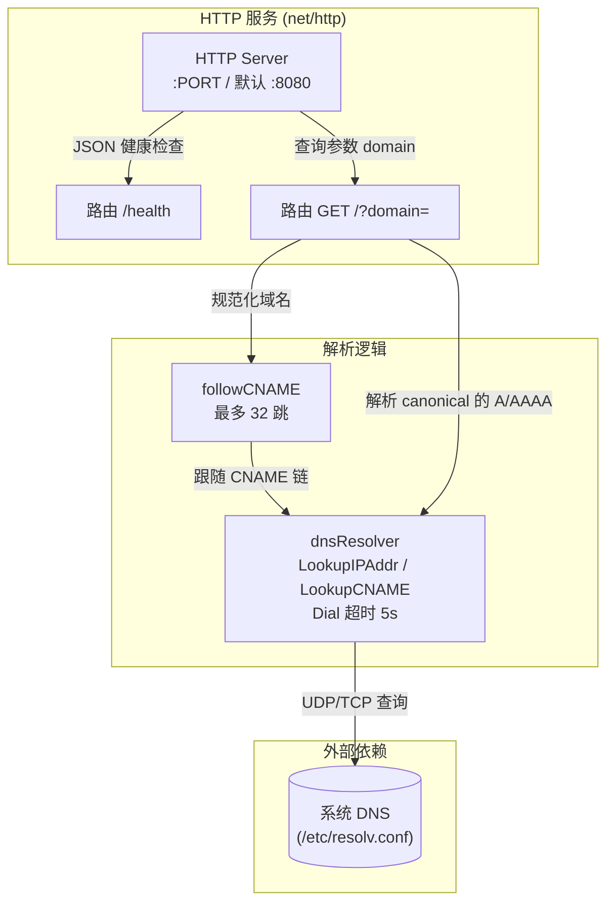
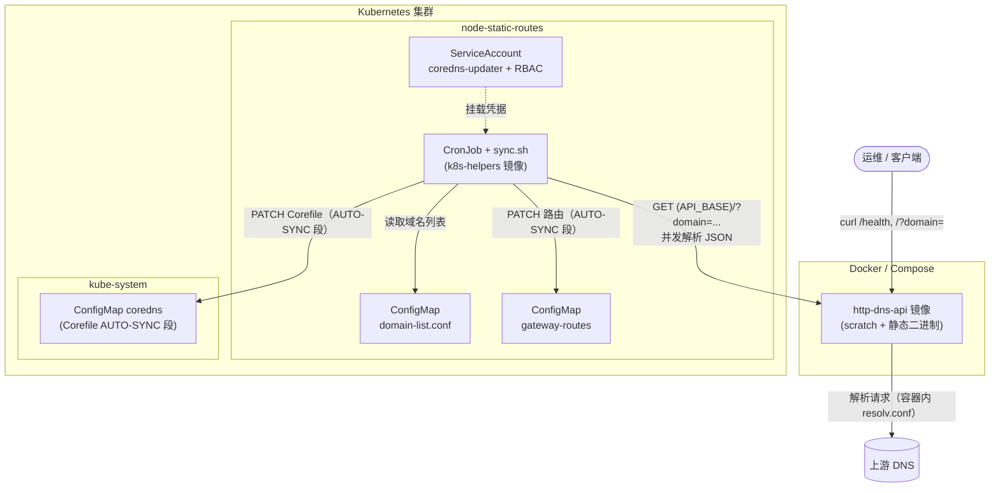
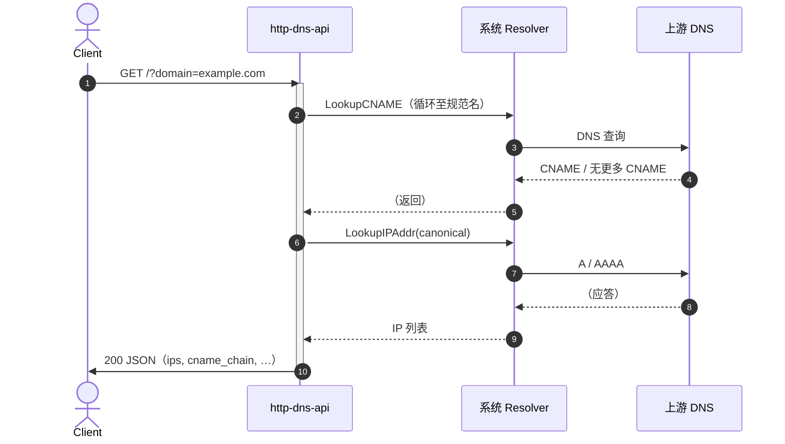

# http-dns-api 架构图（Mermaid）

与 [`architecture.puml`](architecture.puml) 对应：**三幅图**分别表示应用内部结构、部署与 Kubernetes 集成、典型解析请求的时序。下列 Mermaid 在 GitHub、GitLab 及多数支持 Mermaid 的 Markdown 预览中可渲染。

---

## 1. 应用内部结构（main.go）

与 PlantUML 中组件、包及连线含义一致：`srv` 分发到 `/health` 与 `/?domain=`；`followCNAME` 与最终 `LookupIPAddr` 均经 `dnsResolver`；解析走系统 DNS（`/etc/resolv.conf`）。



> **与 PlantUML `note right of r` 一致**：成功时响应含 `domain`、`canonical`、`cname_chain`、`ips`（IPv4 在前 IPv6 在后）；失败时 JSON 带 `error`，部分情况 HTTP `422`。

---

## 2. 部署形态与 Kubernetes 集成（yaml/deploy.yaml）

与 PlantUML 一致：运维/客户端经 Docker 使用服务；镜像内进程通过 `resolv.conf` 访问上游 DNS；集群内 CronJob 读域名列表、请求 `http-dns-api`、PATCH 网关与 CoreDNS 的 ConfigMap；ServiceAccount 与 CronJob 为凭据关系。



> **与 PlantUML `note bottom of cron` 一致**：仅当全部域名解析成功才更新 ConfigMap；先更新网关静态路由并等待生效，再改 CoreDNS，避免解析到新 IP 时尚无路由。

---

## 3. 典型请求序列：GET /?domain=example.com

与 PlantUML 序列图一致：客户端请求 API；API 经系统 Resolver 做 CNAME 链解析，再 `LookupIPAddr`；与上游 DNS 的交互分 CNAME 与 A/AAAA 两阶段；最后返回 200 JSON。



---

## 与 PlantUML 的差异说明

| 项目 | 说明 |
|------|------|
| 形状 | Mermaid 用 `subgraph`/`flowchart` 近似 package、node、cloud；语义以连线与标签为准。 |
| 注记 | PlantUML 的 `note` 用本文件各图下方的 Markdown 引用块对应，避免在 Mermaid 中硬编码大段说明。 |
| `bash` 的 `${API_BASE}` | Mermaid 连线标签里 `$`、`{`、`}` 易被当作语法，故写成 **`(API_BASE)`** 表示占位；语义与 `yaml/sync.sh` 中的环境变量 **`API_BASE`** 相同。 |

若需与 README 并列展示，可将本文件链接过去或嵌入对应 ` ```mermaid ` 代码块。
